# Interactive Diagrams -- Phase 1 Implementation Plan

**Scope:** Modules 01, 02, 03
**Total diagrams:** 13 (4 + 5 + 4)
**Target:** Inline Mermaid diagrams embedded directly in module markdown files

---

## 1. Technical Approach

### 1.1 Diagram Format: Mermaid (Inline Markdown)

The module-viewer already has full Mermaid support built in. No viewer changes are needed.

**Evidence from `module-viewer.html`:**

- Mermaid 11 is loaded via CDN (`https://cdn.jsdelivr.net/npm/mermaid@11/dist/mermaid.min.js`)
- `mermaid.initialize()` is called with `startOnLoad: false`, `securityLevel: 'loose'`, `theme: 'base'`
- Custom theme variables are defined for both light and dark mode, mapping to the course design tokens (`--primary: #6366f1`, `--accent: #06b6d4`, `--success: #10b981`, etc.)
- The `renderMermaid()` function finds all `<pre><code class="language-mermaid">` blocks and replaces them with `<div class="mermaid-wrapper"><div class="mermaid">...</div></div>`, then calls `mermaid.run()`
- CSS for `.mermaid-wrapper` is already defined with responsive padding, centered layout, and proper SVG scaling
- Theme switches trigger a full page reload so Mermaid re-renders with correct contrast

**Conclusion:** Diagrams are written as standard Mermaid code blocks in markdown (triple-backtick `mermaid`). The viewer handles everything else. No HTML, no separate files, no new dependencies.

### 1.2 Existing Diagrams in Modules

The three target modules already contain some Mermaid diagrams:

| Module | Existing Diagrams | Description |
|--------|------------------|-------------|
| 01 | 2 | Three Eras flowchart (section 1.1), PRAO loop flowchart (section 1.2) |
| 02 | 1 | Claude Code Architecture flowchart (section header) |
| 03 | 2 | PRAO state diagram (section 3.2), Extended Thinking complexity flowchart (section 3.5) |

New diagrams must complement these existing ones without redundancy.

### 1.3 Example Diagrams Analysis

Two standalone HTML examples exist at `examples/module-diagrams/`:

- **`era-diagram.html`**: Interactive tabbed panel showing the three AI eras with animated flow nodes, characteristic grids, cost-of-error bars, and example blocks. Uses vanilla JS, custom CSS, DM Sans + JetBrains Mono fonts. Dark theme (#0c0c0f background).
- **`collaboration-model.html`**: Interactive card-based selector showing 4 collaboration modes (3 failures + 1 productive pattern) with dynamic panel content, capability utilization bars, and step lists. Same tech stack and design language.

These examples demonstrate a richer interaction model (click-to-reveal, animated transitions) than what Mermaid provides. They serve as design inspiration but the implementation approach for the modules will use inline Mermaid for consistency with the existing viewer pipeline. The examples may be referenced as "enhanced standalone versions" later.

### 1.4 Design Token Alignment

All new Mermaid diagrams MUST use the following classDef patterns to match the existing course diagrams:

```
classDef phase fill:#1e2240,stroke:#6366f1,stroke-width:2px,color:#f1f5f9,font-weight:bold
classDef io    fill:#172035,stroke:#475569,stroke-width:1px,color:#94a3b8
classDef tool  fill:#172035,stroke:#475569,stroke-width:1px,color:#94a3b8
classDef entry fill:#0d2820,stroke:#10b981,stroke-width:2px,color:#f1f5f9,font-weight:bold
classDef core  fill:#1e2240,stroke:#6366f1,stroke-width:2px,color:#f1f5f9
classDef ctx   fill:#2a1f0d,stroke:#f59e0b,stroke-width:1px,color:#f1f5f9
classDef model fill:#0d2030,stroke:#06b6d4,stroke-width:2px,color:#f1f5f9,font-weight:bold
classDef warn  fill:#2a0f0f,stroke:#f87171,stroke-width:2px,color:#f1f5f9
classDef dim   fill:#172035,stroke:#475569,stroke-width:1px,color:#94a3b8
```

These are extracted from the existing diagrams in the three modules. All new diagrams must reuse these exact definitions for visual consistency.

### 1.5 Module-Viewer Changes Needed

**None.** The viewer already supports:
- Mermaid rendering via `renderMermaid()`
- Dark/light theme switching with proper Mermaid theme variables
- Responsive `.mermaid-wrapper` styling
- Font override to Inter for Mermaid SVG text

### 1.6 CSS Additions Needed

**None.** The existing `.mermaid-wrapper` CSS handles all needed styling.

---

## 2. Diagram Inventory Per Module

### 2.1 Module 01: The Paradigm Shift (4 new diagrams)

**Existing diagrams:** Three Eras flowchart (1.1), PRAO loop flowchart (1.2)

#### Diagram 1.A: Session vs. Persistent Context

- **Concept:** The boundary between session context and persistent context (CLAUDE.md, files on disk, settings.json). This is introduced in section 1.3 but only described in prose.
- **Type:** Flowchart (two-column layout)
- **Insert after:** The "Session Context vs. Persistent Context" heading in section 1.3 (immediately after the line: "Understanding the boundary between what survives sessions and what doesn't is operationally critical.")
- **Complexity:** Simple
- **Specification:**

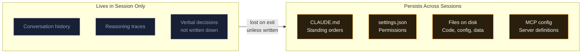

#### Diagram 1.B: Failure Modes Comparison

- **Concept:** The three failure modes (autocomplete mindset, magic box, rubber-stamping) vs. the productive pattern, showing capability utilization.
- **Type:** Flowchart with labeled nodes
- **Insert after:** The "Most engineers who struggle with Claude Code are failing in one of three predictable ways." paragraph in section 1.4 (before "Failure Mode 1")
- **Complexity:** Medium
- **Specification:**

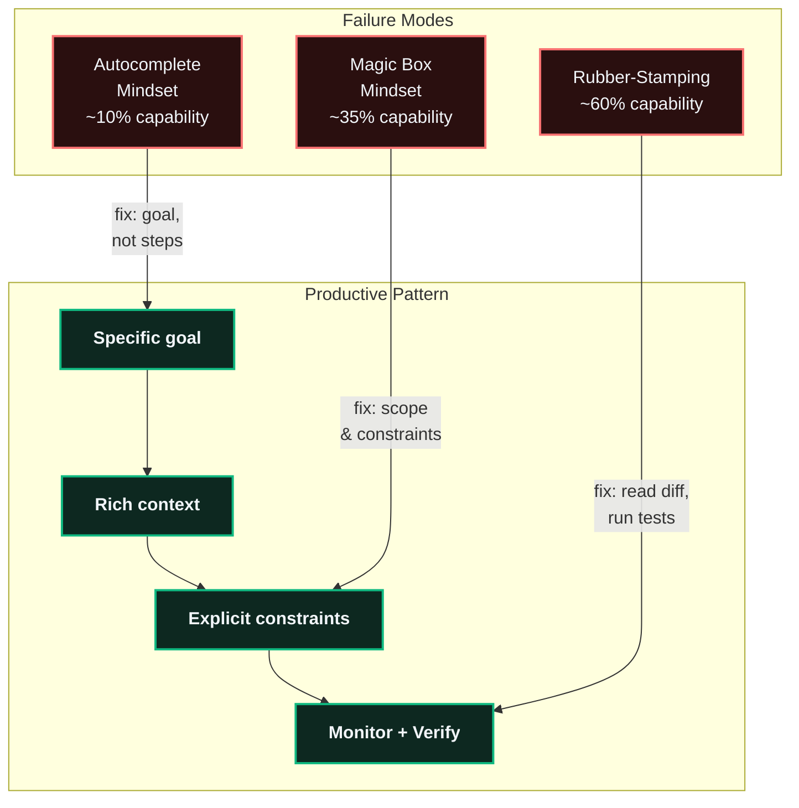

#### Diagram 1.C: Task Suitability Matrix

- **Concept:** The decision framework for when to use agentic AI vs. other approaches, based on the four criteria (duration, specificity, verifiability, error cost).
- **Type:** Quadrant chart
- **Insert after:** The "The questions to ask before using the agent:" list in section 1.5 (before the milestone check details block)
- **Complexity:** Simple
- **Specification:**

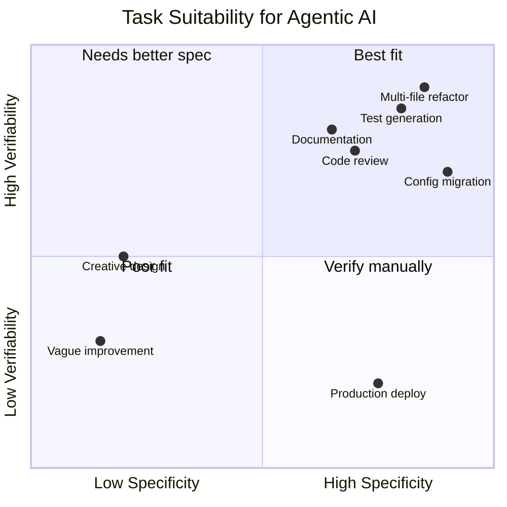

#### Diagram 1.D: PRAO Worked Example Sequence

- **Concept:** The TypeScript typing worked example from section 1.2, shown as a sequence diagram with the two PRAO cycles clearly labeled.
- **Type:** Sequence diagram
- **Insert after:** The "Cycle 2 (if tests fail):" block in section 1.2 (after the paragraph ending "...or the agent reaches a point of genuine ambiguity")
- **Complexity:** Medium
- **Specification:**

```mermaid
sequenceDiagram
    participant H as Human
    participant A as Agent
    participant E as Environment

    H->>A: "Add TypeScript types to src/utils.ts"

    rect rgb(30, 34, 64)
    Note over A,E: Cycle 1
    A->>E: Read(src/utils.ts)
    E-->>A: file contents
    A->>E: Read(src/utils.test.ts)
    E-->>A: test file contents
    A->>E: Bash(npx tsc --noEmit)
    E-->>A: current type errors
    Note over A: Reason: plan type additions
    A->>E: Write(src/utils.ts)
    E-->>A: file written
    A->>E: Bash(npm test)
    E-->>A: 2 tests FAIL
    end

    rect rgb(42, 15, 15)
    Note over A,E: Cycle 2
    A->>E: Read(test output)
    E-->>A: failure details
    Note over A: Reason: fix type mismatch
    A->>E: Write(src/utils.ts)
    E-->>A: file written
    A->>E: Bash(npm test)
    E-->>A: All tests PASS
    end

    A->>H: Done. Types added, tests pass.
```

---

### 2.2 Module 02: Claude Code Foundations (5 new diagrams)

**Existing diagrams:** Claude Code Architecture flowchart (section header)

#### Diagram 2.A: Interactive vs. Non-Interactive Decision Tree

- **Concept:** The decision framework for choosing between `claude` and `claude -p` modes.
- **Type:** Flowchart (decision tree)
- **Insert after:** The "Decision Framework" heading in section 2.1 (before the paragraph starting "The question to ask is...")
- **Complexity:** Simple
- **Specification:**

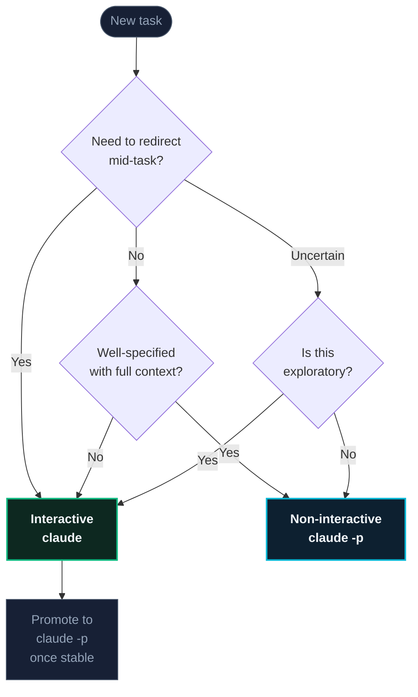

#### Diagram 2.B: CLAUDE.md Hierarchy

- **Concept:** The layered CLAUDE.md system (global, project, local) and how they stack with precedence.
- **Type:** Flowchart (vertical stack)
- **Insert after:** The "The Hierarchy: Global, Project, and Local" heading in section 2.2 (before the paragraph starting "Global CLAUDE.md at...")
- **Complexity:** Simple
- **Specification:**

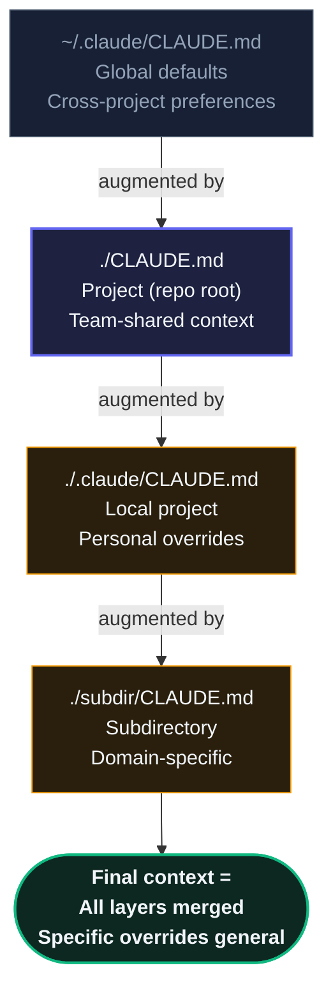

#### Diagram 2.C: Permissions Allow/Deny Flow

- **Concept:** How the allow/deny/approval flow works when the agent wants to take an action.
- **Type:** Flowchart (decision flow)
- **Insert after:** The "The Allow/Deny Model" heading in section 2.3 (before the paragraph starting "Permissions are defined in `settings.json`")
- **Complexity:** Medium
- **Specification:**

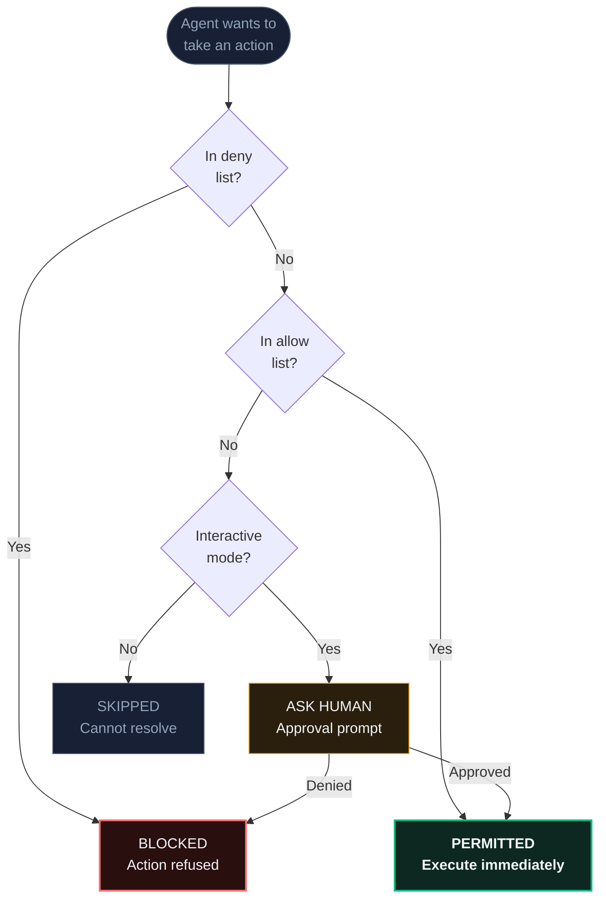

#### Diagram 2.D: MCP Transport Comparison

- **Concept:** The two MCP transport mechanisms (stdio vs. Streamable HTTP) and when to use each.
- **Type:** Flowchart (comparison)
- **Insert after:** The "Transport Mechanisms" heading in section 2.4 (before the paragraph starting "stdio (local):")
- **Complexity:** Simple
- **Specification:**

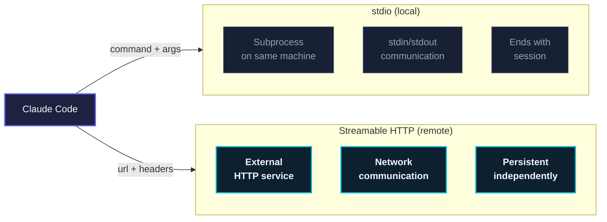

#### Diagram 2.E: Agent Output Layers

- **Concept:** The three layers of agent output (thinking, tool calls, response) and how they map to oversight actions.
- **Type:** Flowchart (vertical)
- **Insert after:** The "The Structure of Agent Output" heading in section 2.5 (before the paragraph starting "Thinking: Before major actions")
- **Complexity:** Medium
- **Specification:**

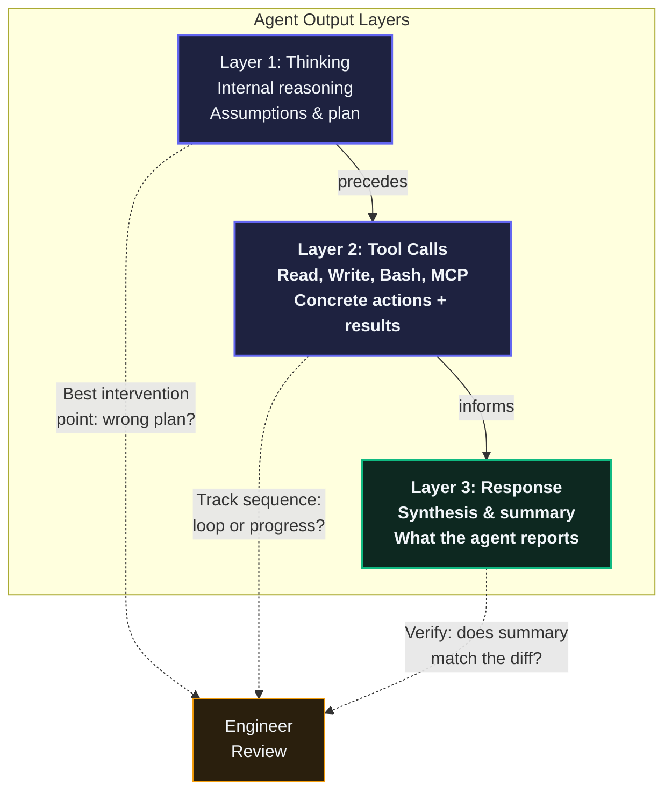

---

### 2.3 Module 03: Agent Thinking (4 new diagrams)

**Existing diagrams:** PRAO state diagram (3.2), Extended Thinking complexity chart (3.5)

#### Diagram 3.A: Three Layers of Agent Output

- **Concept:** The thinking / tool call / response layers described in section 3.1, shown as a layered architecture.
- **Type:** Flowchart (layered)
- **Insert after:** The "Three Layers of Agent Output" heading in section 3.1 (before the paragraph starting "The thinking layer is the agent's internal scratchpad.")
- **Complexity:** Simple
- **Specification:**

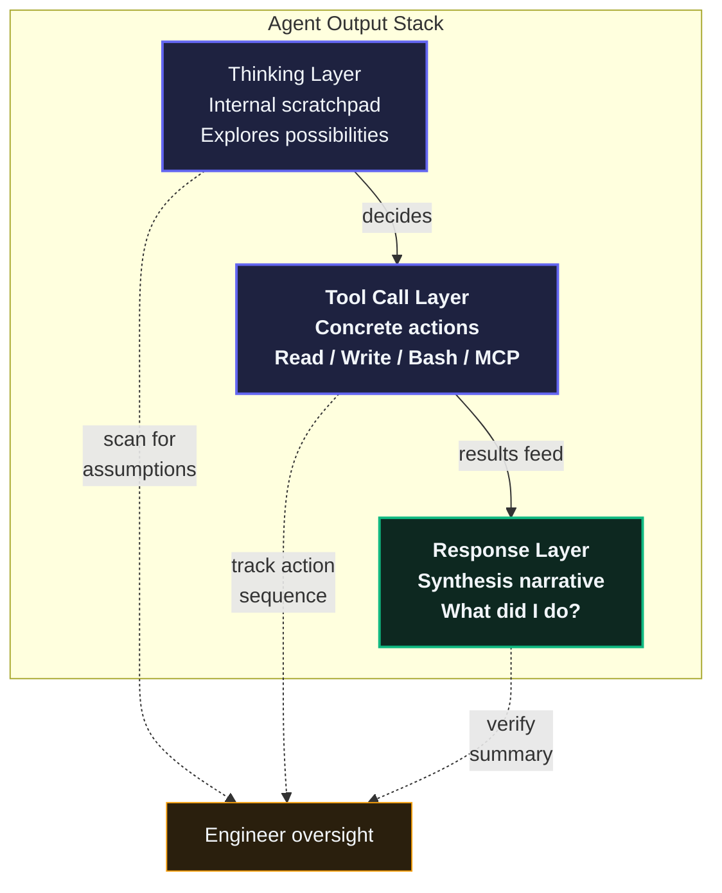

#### Diagram 3.B: Five Tool Call Patterns

- **Concept:** The five common patterns described in section 3.3, shown as distinct sequence patterns for quick visual reference.
- **Type:** Flowchart (pattern catalog)
- **Insert after:** The "Five Common Patterns" heading in section 3.3 (before "Pattern 1")
- **Complexity:** Medium
- **Specification:**

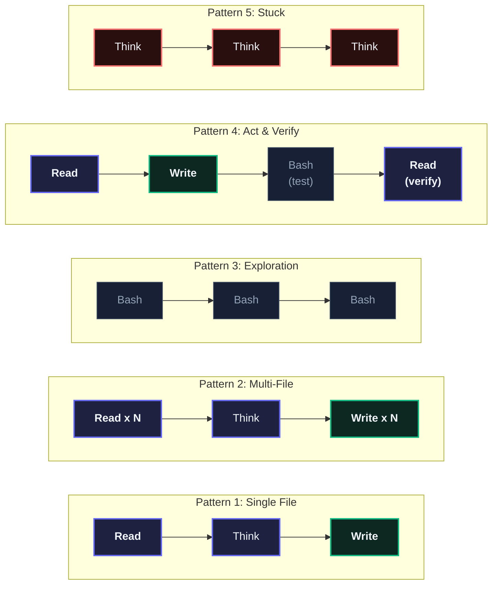

#### Diagram 3.C: Clarification Question Decision Tree

- **Concept:** The three types of clarifying questions (scope, authority, context) and whether to answer in-session or write to CLAUDE.md.
- **Type:** Flowchart (decision tree)
- **Insert after:** The "When to Answer in the Conversation vs. Add to CLAUDE.md" heading in section 3.4 (before the paragraph starting "The dividing line:")
- **Complexity:** Medium
- **Specification:**

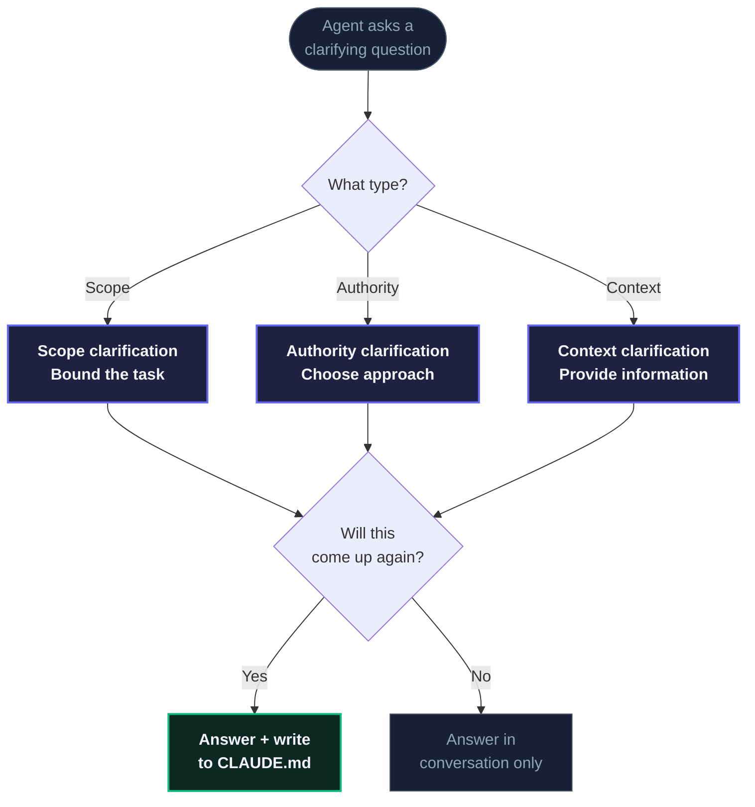

#### Diagram 3.D: Complete Trace Reading -- Bug Fix Sequence

- **Concept:** The complete annotated trace from the "Putting It Together" section, showing the 7-step bug fix as a sequence diagram with PRAO phase labels.
- **Type:** Sequence diagram
- **Insert after:** The "To make these concepts concrete" paragraph in the "Putting It Together" section (before "Step 1 -- Exploration (Perceive):")
- **Complexity:** Medium
- **Specification:**

```mermaid
sequenceDiagram
    participant H as Human
    participant A as Agent
    participant E as Environment

    H->>A: "Find and fix 500 errors on /api/users"

    rect rgb(30, 34, 64)
    Note right of A: PERCEIVE
    A->>E: Bash(grep -r '/api/users' src/)
    E-->>A: 3 files found
    A->>E: Read(routes/users.ts)
    E-->>A: route handler code
    A->>E: Read(services/userService.ts)
    E-->>A: service code
    end

    rect rgb(30, 34, 64)
    Note right of A: REASON
    Note over A: Missing error handling<br/>in route handler.<br/>getUser() throws on<br/>DB unavailability.
    end

    rect rgb(13, 40, 32)
    Note right of A: ACT
    A->>E: Write(routes/users.ts)
    E-->>A: try/catch added
    end

    rect rgb(13, 32, 48)
    Note right of A: OBSERVE
    A->>E: Bash(npm test)
    E-->>A: All tests pass
    A->>E: Bash(npx tsc --noEmit)
    E-->>A: No type errors
    end

    A->>H: Fixed: added try/catch for DB errors.<br/>Returns 503 for DB failures, 404 for not-found.
```

---

## 3. Execution Sequence

### Phase 1: Preparation (no viewer changes needed)

Since the module-viewer already has complete Mermaid support, there is no preparation phase for the viewer itself. However, two preparatory steps are needed:

**Step 1.1: Validate Mermaid rendering for all diagram types used**

Before inserting any new diagrams into modules, validate that the following Mermaid diagram types render correctly in the module-viewer:

- `sequenceDiagram` (used in Diagrams 1.D, 3.D)
- `quadrantChart` (used in Diagram 1.C)
- `flowchart TD` and `flowchart LR` (used in most diagrams)

Validation method: Create a temporary test markdown file at `docs/curriculum/modules/test-diagrams.md` containing one example of each diagram type. Load it in the viewer at `/module/test-diagrams` (or via `?m=test-diagrams`). Verify rendering, dark/light theme, and responsive behavior. Delete the test file after validation.

**Step 1.2: Verify classDef consistency**

Compile the complete set of classDef styles used across all existing diagrams in Modules 01-03. Confirm that the design tokens in section 1.4 of this plan match exactly. Any discrepancy must be resolved before diagram insertion begins.

**Acceptance criteria:**
- All four Mermaid diagram types render correctly in the module-viewer
- Both dark and light themes display properly
- Diagrams are responsive (no horizontal overflow on 375px viewport)
- classDef palette is confirmed and documented

### Phase 2: Module 01 Diagrams (4 diagrams)

Insert the four diagrams specified in section 2.1 into `docs/curriculum/modules/01-paradigm-shift.md`.

**Execution order within this phase:**

1. **Diagram 1.A** (Session vs. Persistent Context) -- Simple, foundational concept
2. **Diagram 1.D** (PRAO Worked Example Sequence) -- Medium, sequence diagram
3. **Diagram 1.B** (Failure Modes Comparison) -- Medium, builds on existing content
4. **Diagram 1.C** (Task Suitability Matrix) -- Simple, quadrant chart (new diagram type, may need iteration)

**For each diagram:**
1. Open `docs/curriculum/modules/01-paradigm-shift.md`
2. Locate the exact insertion point specified in section 2.1
3. Insert the Mermaid code block
4. Load the module in the viewer and verify rendering
5. Check dark mode and light mode
6. Check responsive behavior at mobile viewport (375px)
7. Verify the diagram does not break the section card wrapping (the viewer wraps content between h2 headings into `.module-section` cards)

**Acceptance criteria per diagram:**
- Renders correctly in both themes
- Does not break the section card layout
- Concept is accurately represented
- Labels are readable at default zoom
- No horizontal overflow on mobile

### Phase 3: Module 02 Diagrams (5 diagrams)

Insert the five diagrams specified in section 2.2 into `docs/curriculum/modules/02-claude-code-foundations.md`.

**Execution order within this phase:**

1. **Diagram 2.A** (Interactive vs. Non-Interactive Decision Tree) -- Simple
2. **Diagram 2.B** (CLAUDE.md Hierarchy) -- Simple
3. **Diagram 2.C** (Permissions Allow/Deny Flow) -- Medium
4. **Diagram 2.D** (MCP Transport Comparison) -- Simple
5. **Diagram 2.E** (Agent Output Layers) -- Medium

Same per-diagram verification process as Phase 2.

### Phase 4: Module 03 Diagrams (4 diagrams)

Insert the four diagrams specified in section 2.3 into `docs/curriculum/modules/03-agent-thinking.md`.

**Execution order within this phase:**

1. **Diagram 3.A** (Three Layers of Agent Output) -- Simple
2. **Diagram 3.B** (Five Tool Call Patterns) -- Medium (most complex Mermaid in this plan)
3. **Diagram 3.C** (Clarification Question Decision Tree) -- Medium
4. **Diagram 3.D** (Complete Trace Reading Sequence) -- Medium, sequence diagram

Same per-diagram verification process as Phases 2-3.

### Phase 5: Cross-Module Consistency Review

After all 13 diagrams are inserted, perform a full consistency review:

**5.1 Visual consistency audit:**
- Open all three modules side by side
- Verify all diagrams use the same classDef color tokens
- Verify font rendering is consistent (Inter for labels)
- Verify node shape conventions are consistent (rounded rectangles for actions, diamonds for decisions, stadiums for I/O)

**5.2 Content accuracy review (MERCURIO check):**
- Verify every diagram accurately represents the concept described in the surrounding prose
- Verify no diagram introduces claims not supported by the module text
- Verify terminology in diagram labels matches the module's defined terms exactly
- Cross-reference: do any diagrams contradict each other across modules?

**5.3 Responsive behavior audit:**
- Test all three modules at 1440px, 1024px, 768px, 375px viewport widths
- Verify no diagram causes horizontal scrollbar on the page (overflow within `.mermaid-wrapper` is acceptable and handled by CSS)

**5.4 Theme switching audit:**
- Switch between dark and light themes on each module
- Verify Mermaid re-renders with correct contrast (the viewer reloads on theme switch)
- Verify no text-on-text contrast issues

**Acceptance criteria for Phase 5:**
- Zero visual inconsistencies across the 13 diagrams
- Zero content accuracy issues
- All diagrams responsive at all tested viewport widths
- Both themes render correctly for all diagrams

### Phase 6: Deploy

Deploy to Vercel:

```bash
cd /Users/manu/Documents/LUXOR/PROJECTS/agentic-ai-course
npx vercel deploy --prod --yes --scope manu-mulaveesalas-projects
```

Post-deploy verification:
- Load each of the three modules on the live site
- Verify Mermaid CDN loads correctly in production
- Spot-check one diagram per module for correct rendering

---

## 4. Agent Team Composition

### 4.1 Builder Agent: `frontend-architect`

**Role:** Creates and inserts all Mermaid diagrams into the markdown files.

**Responsibilities:**
- Write Mermaid code blocks following the specifications in section 2
- Insert diagrams at the exact locations specified
- Ensure classDef tokens match the palette in section 1.4
- Verify rendering in the module-viewer after each insertion

**Scope:** One `frontend-architect` handles all three modules sequentially (Phases 2-4). The diagrams are inline Mermaid in markdown -- there are no separate component files, no CSS changes, and no viewer modifications. A single agent can handle this efficiently.

### 4.2 Review Agent: `superpowers:code-reviewer`

**Role:** Reviews each module after its diagrams are inserted.

**Responsibilities:**
- Verify the Mermaid syntax is valid
- Verify insertion points are correct (after the right heading, not disrupting document flow)
- Verify classDef consistency with existing diagrams
- Check that no existing content was accidentally modified or deleted
- Flag any diagram that seems redundant with existing diagrams

**Cycle:** After Phase 2 (Module 01 complete), `code-reviewer` reviews. Builder addresses feedback. Same for Phases 3 and 4.

### 4.3 Accuracy Agent: `MERCURIO`

**Role:** Validates content accuracy of all diagrams against the module prose.

**When it runs:** Phase 5 (cross-module consistency review), after all diagrams are inserted and reviewed.

**What it validates:**
- Every label in every diagram uses terminology defined in the module text
- No diagram introduces concepts not covered in the module
- No diagram contradicts the module's stated claims
- Sequence diagrams accurately reflect the worked examples in the prose
- Decision trees accurately reflect the decision frameworks described in prose

**Output:** A validation report listing each diagram with PASS/FAIL and specific issues if any.

### 4.4 Review Cycle

```
For each phase (Module 01, 02, 03):
  1. frontend-architect inserts all diagrams for that module
  2. code-reviewer reviews the changes (diff review)
  3. If issues found: frontend-architect fixes, code-reviewer re-reviews
  4. If clean: proceed to next module

After all three modules complete:
  5. MERCURIO runs content accuracy validation across all 13 diagrams
  6. If issues found: frontend-architect fixes, MERCURIO re-validates
  7. If clean: proceed to deploy
```

---

## 5. Quality Gates

Every diagram must pass ALL of the following before acceptance:

### 5.1 Technical Accuracy (MERCURIO)
- [ ] Diagram accurately represents the concept described in surrounding prose
- [ ] All labels use terminology consistent with the module's defined terms
- [ ] No fabricated concepts, layers, or relationships not present in the module text
- [ ] Sequence diagrams match the worked examples exactly

### 5.2 Visual Clarity and Readability
- [ ] All node labels are readable at default browser zoom (100%)
- [ ] Arrow labels are legible and not overlapping
- [ ] Diagram has a clear visual hierarchy (primary flow is obvious)
- [ ] Subgraph labels are descriptive and correctly bounded

### 5.3 Responsive Design
- [ ] No page-level horizontal scrollbar at any tested viewport (1440px, 1024px, 768px, 375px)
- [ ] Diagram scales proportionally within `.mermaid-wrapper`
- [ ] Text remains legible at 375px viewport width (may require horizontal scroll within the wrapper, which is acceptable)

### 5.4 Style Consistency
- [ ] Uses only classDef tokens from the approved palette (section 1.4)
- [ ] Node shapes follow the convention: rounded rectangles for processes, diamonds for decisions, stadiums for I/O
- [ ] Color semantics are consistent: green (#10b981) = positive/success, red (#f87171) = warning/failure, blue (#6366f1) = primary/action, cyan (#06b6d4) = model/external, amber (#f59e0b) = context/persistent

### 5.5 Interactivity and Rendering
- [ ] Mermaid code block renders without errors in the module-viewer
- [ ] Dark theme renders correctly (verified after theme switch + page reload)
- [ ] Light theme renders correctly
- [ ] No JavaScript console errors related to Mermaid rendering

### 5.6 Module Integration
- [ ] Diagram does not break the `.module-section` card wrapping
- [ ] Diagram appears in the correct section (under the right h2)
- [ ] Reading progress tracking still works correctly
- [ ] No existing content was modified or deleted during insertion

---

## 6. File Paths Reference

All work happens in these files:

| File | Action |
|------|--------|
| `docs/curriculum/modules/01-paradigm-shift.md` | Insert 4 Mermaid code blocks |
| `docs/curriculum/modules/02-claude-code-foundations.md` | Insert 5 Mermaid code blocks |
| `docs/curriculum/modules/03-agent-thinking.md` | Insert 4 Mermaid code blocks |
| `module-viewer.html` | NO CHANGES needed |

Supporting files (read-only reference):
| File | Purpose |
|------|---------|
| `examples/module-diagrams/era-diagram.html` | Design reference for interaction patterns |
| `examples/module-diagrams/collaboration-model.html` | Design reference for card-based layouts |

---

## 7. Risk Assessment

### Low Risk
- **Mermaid rendering:** The viewer already renders Mermaid successfully (5 existing diagrams across the 3 modules). The pipeline is proven.
- **Flowchart diagrams:** 10 of 13 diagrams are flowcharts, which is the most reliable Mermaid diagram type.

### Medium Risk
- **Sequence diagrams (1.D, 3.D):** Mermaid sequence diagrams with `rect` backgrounds may render differently across Mermaid versions. Mitigation: test in Phase 1 validation step.
- **Quadrant chart (1.C):** This is a newer Mermaid chart type. May not be supported in all Mermaid 11 versions. Mitigation: test in Phase 1; if unsupported, fall back to a flowchart-based representation.
- **Five Tool Call Patterns diagram (3.B):** Five subgraphs in a single flowchart may be visually crowded. Mitigation: if too dense, split into two diagrams (patterns 1-3 and patterns 4-5) or use a vertical layout instead of horizontal.

### Contingency Plans
- If `quadrantChart` is not supported: replace Diagram 1.C with a 2x2 grid flowchart using subgraphs
- If sequence diagram `rect` backgrounds don't render: remove the rect wrappers and use `Note` annotations for cycle labeling instead
- If any diagram is too wide for mobile: switch its direction from `LR` to `TD`

---

## 8. Summary

| Module | New Diagrams | Total (with existing) | Diagram Types |
|--------|--------------|-----------------------|---------------|
| 01 - Paradigm Shift | 4 | 6 | flowchart, sequence, quadrant |
| 02 - Claude Code Foundations | 5 | 6 | flowchart (all) |
| 03 - Agent Thinking | 4 | 6 | flowchart, sequence |
| **Total** | **13** | **18** | |

**Team:** 3 agents (frontend-architect builder, code-reviewer, MERCURIO accuracy validator)

**Estimated effort:** 4-6 hours total (1 hour prep, 1 hour per module, 1-2 hours cross-review and deploy)

**Zero viewer changes required.** All diagrams are inline Mermaid in markdown, rendered by the existing module-viewer pipeline.
