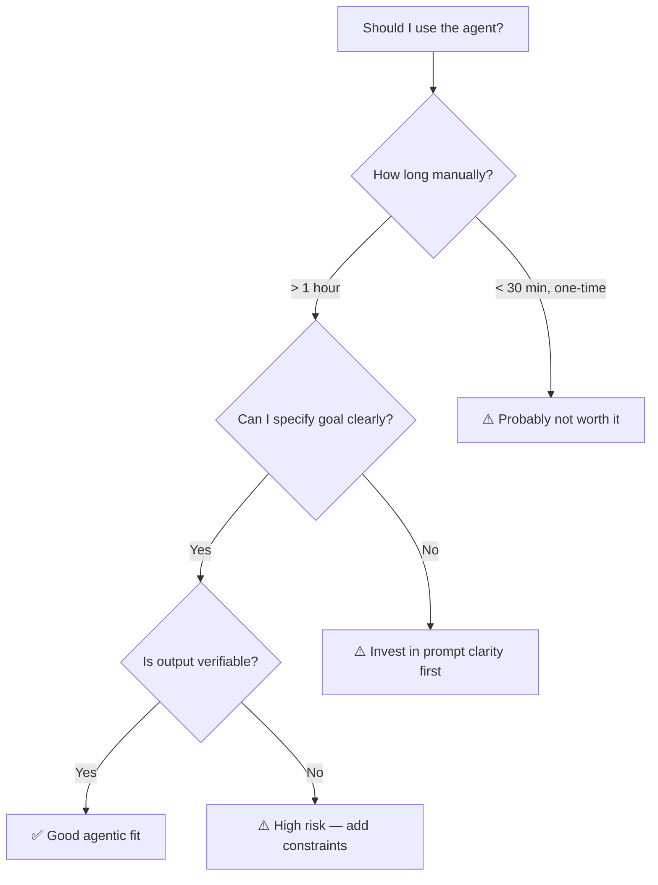

# Second-Pass Review: Modules 01–03
## Agentic AI Engineering Course — Independent Quality Audit

**Reviewer**: MERCURIO (second-pass, independent)
**Date**: 2026-03-16
**Scope**: `docs/curriculum/modules/01-paradigm-shift.md`, `02-claude-code-foundations.md`, `03-agent-thinking.md`
**Method**: Line-by-line reading + factual verification against official Anthropic docs + cross-module consistency check

---

## Executive Summary

Modules 01–03 form a strong conceptual foundation. The writing is professional, clear, and appropriately opinionated. The three-eras framework (Module 01), the operational walkthrough (Module 02), and the trace-reading skill (Module 03) build a coherent progression from mental model → configuration → observation.

**5 Critical defects** require correction before the content can be considered production-accurate. **6 High-priority issues** affect curriculum coherence or completeness. **5 Medium issues** address terminology consistency and forward-referencing. **4 Low issues** identify UX enhancement opportunities.

| Severity | Count | Summary |
|----------|-------|---------|
| 🔴 CRITICAL | 5 | Factual errors against official docs |
| 🟠 HIGH | 6 | Curriculum coherence, missing content |
| 🟡 MEDIUM | 5 | Terminology drift, forward-references |
| 🔵 LOW | 4 | UX/engagement opportunities |

---

## 🔴 CRITICAL — Factual Errors (must fix)

### C1: CLAUDE.md project location is wrong

**File**: `02-claude-code-foundations.md`, line 124
**Claim**: "Project CLAUDE.md at `.claude/CLAUDE.md` within your project directory"
**Reality**: The canonical project CLAUDE.md is at `./CLAUDE.md` (project root), not `.claude/CLAUDE.md`. Claude Code reads memory files recursively from the current working directory upward to `/`. The `.claude/` directory holds `settings.json`, not the primary CLAUDE.md.

**Official source**: [How Claude remembers your project](https://docs.anthropic.com/en/docs/claude-code/memory) — documents recursive discovery from cwd upward, with `CLAUDE.md` at project root as the primary location.

**Also affected**: Module 02 line 120 ("The Hierarchy: Global and Project") frames the hierarchy as only two levels. The actual hierarchy is:
1. `~/.claude/CLAUDE.md` — global/user-level
2. `CLAUDE.md` files in parent directories (recursive upward)
3. `./CLAUDE.md` — current project root
4. `CLAUDE.local.md` — local overrides (gitignored)

**Recommended fix**: Rewrite section 2.2 "The Hierarchy" to accurately reflect:
- `./CLAUDE.md` at project root (shared, committed)
- `./CLAUDE.local.md` at project root (personal, gitignored)
- `~/.claude/CLAUDE.md` for global defaults
- Recursive upward discovery behavior

---

### C2: Missing CLAUDE.local.md — operationally important omission

**File**: `02-claude-code-foundations.md`, entire section 2.2
**Claim**: Only two CLAUDE.md files exist (global and project)
**Reality**: `CLAUDE.local.md` is a documented companion file for personal/local overrides that is gitignored by convention. This is essential for team workflows where engineers need personal preferences without polluting the shared `CLAUDE.md`.

**Official source**: [How Claude remembers your project](https://docs.anthropic.com/en/docs/claude-code/memory)

**Recommended fix**: Add a subsection under 2.2 explaining `CLAUDE.local.md` and when to use it (personal conventions, local paths, machine-specific config).

---

### C3: MCP example uses deprecated SSE URL while teaching SSE is deprecated

**File**: `02-claude-code-foundations.md`, lines 375–383
**The contradiction**:
- Line 356: "The older SSE (Server-Sent Events) transport is deprecated and should not be used"
- Line 376: `"url": "https://mcp.linear.app/sse"` ← SSE endpoint in an example config
- Line 389: `"type": "http"` ← labeled as HTTP but pointing at SSE URL

This is a self-contradiction within the same module. A learner following this example would configure exactly what the module tells them not to.

**Recommended fix**: Replace the Linear example URL with a generic Streamable HTTP endpoint or a clearly fictional example. If the real Linear endpoint is still `/sse`, add an explicit callout explaining the discrepancy (legacy URL path ≠ deprecated transport).

---

### C4: Extended thinking description likely outdated

**File**: `03-agent-thinking.md`, line 269
**Claim**: "Extended thinking is a model capability exposed through the API. It is not a CLI flag."
**Reality**: Evidence from GitHub issues and community reports indicates Claude Code now supports `--thinking` as a CLI toggle, plus `/think` and `/effort` slash commands for controlling thinking mode interactively. The Claude Code creator (Boris Cherny) has shared publicly that he keeps extended thinking on at all times (January 2026).

**Official sources**:
- [CLI reference](https://docs.anthropic.com/en/docs/claude-code/cli-reference)
- [Building with extended thinking](https://docs.anthropic.com/en/docs/build-with-claude/extended-thinking)
- GitHub issue [#7668](https://github.com/anthropics/claude-code/issues/7668) — Configuration and Documentation for Thinking Mode

**Note**: This also conflicts with Content Accuracy Rule #1 in `progress.md` ("No `--thinking` flag — not a CLI flag"). **The accuracy rule itself may be outdated** and should be verified against the current CLI reference before Module 03 is updated.

**Recommended fix**: Verify the current CLI reference. If `--thinking` exists, update Module 03 section 3.5 to accurately describe how to enable extended thinking in Claude Code (CLI flag, slash command, and/or settings). Update accuracy rule #1 accordingly.

---

### C5: MCP config `type` field may not match current schema

**File**: `02-claude-code-foundations.md`, lines 366–389
**Claim**: MCP servers use `"type": "stdio"` or `"type": "http"` fields
**Reality**: The actual Claude Code MCP configuration distinguishes stdio servers (which have `command` + `args` keys) from HTTP servers (which have `url` key). The presence of `command`/`args` vs `url` is the discriminator — a separate `type` field may not be required or may use different values in current versions.

**Official source**: [Claude Code settings](https://docs.anthropic.com/en/docs/claude-code/settings) — check the `mcpServers` schema for current field names.

**Recommended fix**: Verify the exact MCP config schema against current docs. If `type` is not a required/used field, remove it from examples to avoid confusion. If it is used, verify the exact accepted values.

---

## 🟠 HIGH — Curriculum Coherence (should fix)

### H1: Module 01 missing Further Reading section

**File**: `01-paradigm-shift.md`, lines 294–301
**Issue**: Module 01 ends with "Lab Connection" and a "Next:" teaser but has NO "Further Reading" section. Modules 02 and 03 both have proper Further Reading with official docs URLs and research paper citations. This is a structural inconsistency already flagged in `progress.md` ("⚠️ Lab link only").

**Impact**: Module 01 is the conceptual foundation. Learners who want to go deeper have no guided path. The ReAct paper (Yao et al., 2023) is cited in Module 02's Further Reading but is arguably more relevant to Module 01's PRAO loop discussion.

**Recommended fix**: Add a Further Reading section to Module 01 with:
- [Claude Code Overview](https://docs.anthropic.com/en/docs/claude-code/overview) — official starting point
- [Claude Code GitHub Repository](https://github.com/anthropics/claude-code) — changelog, release notes
- Yao et al. (2023) ReAct paper — the reasoning+action loop that underpins PRAO (move from Module 02 or duplicate)
- Schick et al. (2023) "Toolformer" — relevant to tool-use agency concept

---

### H2: PRAO diagram forward-references "Extended thinking" before it's defined

**File**: `01-paradigm-shift.md`, line 85
**The label**: `R(["🧠 Reason\nPlan approach\nExtended thinking"])`
**Issue**: "Extended thinking" is a specific technical term introduced and explained in Module 03 (section 3.5, 18 paragraphs of coverage). Using it in Module 01's PRAO diagram without definition creates a forward-reference that may confuse learners or create incorrect expectations.

**Also in**: `03-agent-thinking.md`, line 60: `Reason : 🧠 Reason\nPlan with extended thinking` — same issue in the Module 03 state diagram.

**Recommended fix**: In Module 01's diagram, change the Reason node label to:
```
R(["🧠 Reason\nPlan approach\nDeliberate"])
```
This accurately describes what happens without forward-referencing a specific API feature. Module 03's diagram can keep "extended thinking" since it's defined in the same module.

---

### H3: Module 02 doesn't mention `settings.local.json`

**File**: `02-claude-code-foundations.md`, section 2.3
**Issue**: The official docs document three settings files:
1. `~/.claude/settings.json` — global (user-level)
2. `.claude/settings.json` — project (committed, shared)
3. `.claude/settings.local.json` — project-local (not committed, personal)

Module 02 only teaches #1 and #2. The `.local.json` variant is important for the same reason as `CLAUDE.local.md` — team members need personal permission overrides without affecting shared config.

**Official source**: [Claude Code settings](https://docs.anthropic.com/en/docs/claude-code/settings)

**Recommended fix**: Add a brief mention of `settings.local.json` in section 2.3 "Configuration Levels" with a one-sentence explanation of when to use it.

---

### H4: "Junior engineer" metaphor is imprecise

**File**: `01-paradigm-shift.md`, line 72
**Claim**: "The right mental model is: a junior engineer with codebase access"
**Issue**: This metaphor is extremely common in the AI community but misleading in both directions:
- Claude Code can perform tasks (cross-file refactoring, pattern detection, multi-language analysis) that most junior engineers cannot
- Claude Code lacks situational judgment, institutional knowledge, and social context that even junior engineers possess
- The metaphor may create a ceiling expectation ("only junior-level work") that underestimates the tool

**Recommended fix**: Refine the metaphor to be more precise:
> "The right mental model is: a capable engineer who is new to your codebase — technically skilled but lacking institutional context, who needs to be briefed on conventions and constraints, who will take initiative but benefits from clear boundaries, and whose work you review before shipping."

This preserves the key insight (brief them, constrain them, review their work) while avoiding the capability ceiling implication.

---

### H5: Module 03 NotebookLM banner still present

**File**: `03-agent-thinking.md`, line 4
**Content**: `**Source document for NotebookLM. Use to generate: video scripts, slide decks, podcasts, and flashcards.**`
**Issue**: `progress.md` item #9 documents that this banner was "removed from both files" (Modules 01 and 02) but it remains in Module 03. This is a production artifact that should not appear in learner-facing content.

**Recommended fix**: Delete line 4 from `03-agent-thinking.md`.

---

### H6: Module 01 doesn't mention the approval/permission system at all

**File**: `01-paradigm-shift.md`, section 1.3 "What Claude Code Actually Is"
**Issue**: Module 01 line 64 correctly identifies higher stakes in the agent paradigm: "the cost of a poorly-directed agent action is that it might modify files, run commands, or call services in ways you didn't intend." But the module never mentions that Claude Code has a permission system to mitigate this risk. A learner reading Module 01 alone might conclude the tool is dangerously unconstrained.

**Impact**: The "Productive Collaboration Model" (section 1.4) discusses monitoring and verification but not the structural safety mechanism (permissions) that Module 02 covers in depth.

**Recommended fix**: Add one sentence to section 1.3 or 1.4 foreshadowing the permission system:
> "Claude Code includes a configurable permission system — covered in Module 02 — that lets you define explicit boundaries on what the agent can and cannot do, providing structural safety beyond just monitoring."

---

## 🟡 MEDIUM — Terminology & Consistency

### M1: "Thinking" means two different things across modules

**Across all three modules**
**Issue**: The word "thinking" is used for two distinct concepts:
1. **Standard agent reasoning** — the visible deliberation that precedes tool calls (Module 02 line 451: "thinking block," Module 03: "thinking layer")
2. **Extended thinking** — a specific API-level capability with token budgets (Module 03 section 3.5)

Module 02 uses "thinking" exclusively in sense #1. Module 03 uses it in both senses, with section 3.5 formally distinguishing them. Module 01's PRAO diagram uses it in sense #2 (which hasn't been introduced yet).

**Recommended fix**: Establish consistent terminology:
- **"Reasoning trace"** or **"deliberation"** for the standard visible thinking (sense #1)
- **"Extended thinking"** exclusively for the API-level capability (sense #2)
- Apply this distinction consistently across all three modules

---

### M2: "MCP servers" introduced without context in Module 01

**File**: `01-paradigm-shift.md`, line 60
**Content**: "It calls external APIs via MCP servers."
**Issue**: This is the first mention of MCP in the entire course. No parenthetical expansion, no definition. MCP is covered in detail in Module 02 (section 2.4) and gets dedicated modules (05, 06). A learner encountering "MCP servers" for the first time here has no referent.

**Recommended fix**: Add a parenthetical:
> "It calls external APIs via MCP servers (the Model Context Protocol, covered in Module 02 and in depth on Day 2)."

---

### M3: Inconsistent tool name formatting

**Across Modules 02 and 03**
**Issue**: Tool names are formatted inconsistently:
- Module 02 line 453: `Read("src/auth.ts")`, `Write("src/auth.ts", ...)`, `Bash("npm test")` — function-call style
- Module 03 lines 127–130: Same style (consistent with Module 02)
- Module 03 line 317: `Bash("grep -r '/api/users' src/ --include='*.ts' -l")` — consistent

This is actually consistent across 02 and 03 ✅. However, Module 01's PRAO description (lines 99–105) mentions tools only in prose ("reading files, running `git status`") without using the `ToolName("arg")` format.

**Recommended fix**: Minor — consider adding one `Read("src/utils.ts")` style example in Module 01's worked example (section 1.2) to introduce the format learners will see in Modules 02–03.

---

### M4: Context window mentioned but never quantified

**File**: `01-paradigm-shift.md`, line 54
**Content**: "The AI can reason across a longer context window"
**Issue**: The term "context window" appears exactly once across all three modules, in Module 01's Era Two description, and is never defined or quantified. For an engineering course, learners should understand what a context window is and its practical implications (e.g., why CLAUDE.md must be concise, why long sessions can degrade).

**Recommended fix**: Either:
- (a) Add a one-sentence definition in Module 01 when first mentioned: "The AI can reason across a longer context window — the total amount of text (measured in tokens) the model can process at once."
- (b) Add a brief "Context Window" entry to Module 02's "Key Concepts for Review" section, since it has practical implications for CLAUDE.md sizing.

---

### M5: Module 03 worked examples all use authentication domain

**File**: `03-agent-thinking.md`, sections 3.2, 3.4, and the trace exercise
**Issue**: Every worked example in Module 03 involves authentication/JWT/refresh tokens:
- Section 3.2: "Refactor the user authentication flow to use refresh tokens" (line 73)
- Section 3.4: All three clarifying question examples involve auth (lines 209, 215, 221)
- Trace exercise: "Find and fix the bug causing intermittent 500 errors on /api/users" (line 313)

While the examples are well-crafted, the single-domain focus risks creating the impression that agentic AI is primarily useful for backend/auth work. Module 01 explicitly lists diverse use cases (refactoring, documentation, testing, code review, migration).

**Recommended fix**: Vary at least one example. The trace exercise (section "Putting It Together") could use a frontend, testing, or data pipeline scenario to demonstrate breadth.

---

## 🔵 LOW — UX & Engagement Opportunities

### L1: Trace exercise would benefit from progressive reveal

**File**: `03-agent-thinking.md`, lines 311–358
**Issue**: The complete annotated trace is presented as a wall of text. In the module-viewer, this is a long scroll with no interaction. The step-by-step nature of the exercise is ideal for progressive reveal — show Step 1, let the learner predict what happens next, then reveal Step 2.

**Opportunity**: If the module-viewer supports `<details>`/`<summary>` HTML or collapsible sections, wrap each step in a reveal element:
```html
<details>
<summary>Step 3 — What does the agent reason? (click to reveal)</summary>
[thinking]: The route handler calls userService.getUser(id)...
</details>
```
This transforms passive reading into active engagement without changing any content.

---

### L2: Mermaid diagrams lack reading guides

**All three modules**
**Issue**: The Mermaid diagrams (three-eras flowchart, PRAO loop, architecture diagram, state diagram, thinking-depth chart) are rendered without captions or reading instructions. For learners unfamiliar with flowchart notation, a one-line guide aids comprehension.

**Opportunity**: Add a brief caption below each diagram:
```markdown
*Read left to right: each era builds on the previous, with the key capability shift labeled on the connecting arrow.*
```
This is especially valuable for the state diagram in Module 03 (line 55), which uses a less common notation.

---

### L3: Best Practices sections could be formatted as quick-reference cards

**Modules 01, 02, 03 — Best Practices Summary sections**
**Issue**: The Do/Don't lists at the end of each module largely repeat content from the module body. They serve as review aids but are formatted identically to the teaching prose, making them hard to scan quickly.

**Opportunity**: Format best practices as a visually distinct card or table:
```markdown
| ✅ Do | ❌ Don't |
|-------|---------|
| Describe outcomes | Issue step-by-step micro-instructions |
| Specify constraints explicitly | Use vague goals like "improve the code" |
```
This creates a scannable reference that learners can screenshot or print.

---

### L4: Module 01 "When Agentic AI Is and Isn't the Right Tool" could use a decision flowchart

**File**: `01-paradigm-shift.md`, section 1.5 (lines 221–254)
**Issue**: Section 1.5 presents four decision criteria as a bulleted list (lines 249–253). This is good content but would be more memorable and actionable as a Mermaid decision flowchart.

**Opportunity**:


---

## Cross-Module Coherence Assessment

### Progression Quality: ★★★★☆

The three modules build a clear conceptual ladder:
- **Module 01**: Mental model (what is agency, why it matters)
- **Module 02**: Operational foundation (how to configure and use)
- **Module 03**: Observation skill (how to read and interpret agent behavior)

Each module correctly back-references the previous one:
- Module 02 opens by referencing the PRAO loop from Module 01 ✅
- Module 03 references the "approval pattern from Module 02" (line 44) ✅
- Module 03's trace exercise maps to PRAO phases from Module 01 ✅

**Gap**: There is no forward-looking summary at the end of Module 03 that previews Day 2's shift to applied topics. Line 430 mentions "multi-agent systems, CI/CD integration, MCP server development, and production deployment patterns" but doesn't connect these to the Day 1 foundations just learned.

### Engagement Balance: Professional > Gamer ✅

The tone across all three modules is consistently professional-instructional. No gamified language ("XP," "boss challenge," "level up") appears in the module content — that vocabulary is correctly confined to the lab HTML files and module-viewer UI. The writing reads like a well-edited technical book, which is appropriate for the target audience (senior engineers).

**One minor concern**: The worked examples are excellent but all follow a "lecture" format. Module 03's trace exercise (lines 311–358) comes closest to active learning, but it's still "read and verify" rather than "predict and check." The labs handle the interactive dimension, so this is by design — but worth noting for any future revision.

### Terminology Consistency Matrix

| Term | Module 01 | Module 02 | Module 03 | Consistent? |
|------|-----------|-----------|-----------|-------------|
| PRAO loop | ✅ Defined | ✅ Referenced | ✅ Applied | ✅ Yes |
| CLAUDE.md | ✅ Introduced | ✅ Deep dive | ✅ Referenced | ✅ Yes |
| Tool call | ✅ Defined | ✅ Examples | ✅ Patterns | ✅ Yes |
| Session context | ✅ Defined | ✅ Elaborated | — | ✅ Yes |
| Extended thinking | ⚠️ In diagram only | — | ✅ Full section | ⚠️ Forward-ref |
| Thinking block/layer | — | ✅ Used | ✅ Used | ⚠️ See M1 |
| MCP | ⚠️ No definition | ✅ Full section | — | ⚠️ See M2 |
| Approval pattern | — | ✅ Defined | ✅ Referenced | ✅ Yes |
| Context window | ✅ Mentioned once | — | — | ⚠️ Undefined |

---

## Factual Sanity Check Summary

| Claim | Module:Line | Verdict | Notes |
|-------|-------------|---------|-------|
| CLAUDE.md at `~/.claude/CLAUDE.md` (global) | 02:122 | ✅ Correct | Confirmed in official docs |
| CLAUDE.md at `.claude/CLAUDE.md` (project) | 02:124 | 🔴 Wrong | Should be `./CLAUDE.md` at project root |
| `claude -p "prompt"` for non-interactive | 02:70 | ✅ Correct | Documented in CLI reference |
| `settings.json` allow/deny model | 02:226–243 | ✅ Correct | Confirmed; deny takes precedence |
| Three MCP primitives: Tools, Resources, Prompts | 02:342–348 | ✅ Correct | Matches MCP specification |
| SSE deprecated, Streamable HTTP for remote | 02:356 | ✅ Correct | Matches MCP spec 2025-03-26 |
| Linear example uses `/sse` URL | 02:376 | 🔴 Contradicts | Self-contradicts SSE deprecation |
| Extended thinking "not a CLI flag" | 03:269 | 🔴 Likely wrong | Evidence of `--thinking` flag + `/think` command |
| Extended thinking is API-level | 03:265 | ✅ Correct | Also API parameter; claim is true but incomplete |
| No `--thinking` CLI flag (accuracy rule #1) | progress.md:172 | ⚠️ Verify | Rule may be outdated |
| No `--context` flag | — | ✅ Not claimed | Not present in any module |
| No `/memory` command | — | ✅ Not claimed | Not present in any module |
| `triggers` not native activation | — | ✅ Not claimed | Not present in any module |

---

## Priority Execution Order

For maximum impact with minimum effort, fix in this order:

1. **C3** — Fix the Linear MCP example (5 min, prevents learner confusion)
2. **H5** — Delete NotebookLM banner from Module 03 (30 sec)
3. **C1 + C2** — Rewrite CLAUDE.md hierarchy section in Module 02 (30 min)
4. **H1** — Add Further Reading to Module 01 (15 min)
5. **H2** — Fix PRAO diagram label in Module 01 (2 min)
6. **C4** — Verify and update extended thinking claims (15 min research + 15 min edit)
7. **C5** — Verify MCP config `type` field against current docs (10 min)
8. **H3** — Add `settings.local.json` mention to Module 02 (5 min)
9. **H6** — Add permission system foreshadow to Module 01 (5 min)
10. **M1–M5** — Terminology consistency pass (30 min)
11. **L1–L4** — UX enhancements (optional, 1–2 hours)

**Estimated total for Critical+High**: ~2 hours
**Estimated total including Medium**: ~2.5 hours
**Estimated total including Low**: ~4.5 hours

---

## Sources

### Official Documentation
- [How Claude remembers your project (Memory)](https://docs.anthropic.com/en/docs/claude-code/memory)
- [Claude Code settings](https://docs.anthropic.com/en/docs/claude-code/settings)
- [CLI reference](https://docs.anthropic.com/en/docs/claude-code/cli-reference)
- [Building with extended thinking](https://docs.anthropic.com/en/docs/build-with-claude/extended-thinking)
- [Claude Code Overview](https://docs.anthropic.com/en/docs/claude-code/overview)
- [Claude Code GitHub Repository](https://github.com/anthropics/claude-code)

### GitHub Issues (verification sources)
- [#594 — Global CLAUDE.md file](https://github.com/anthropics/claude-code/issues/594)
- [#7668 — Configuration and Documentation for Thinking Mode](https://github.com/anthropics/claude-code/issues/7668)
- [#2274 — Documentation about CLAUDE.md locations](https://github.com/anthropics/claude-code/issues/2274)

---

*Review produced by MERCURIO second-pass review protocol. All claims verified against official documentation URLs listed above. Line references are to file content as of 2026-03-16.*
